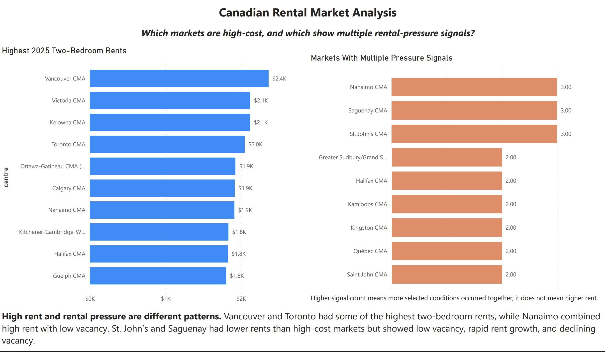
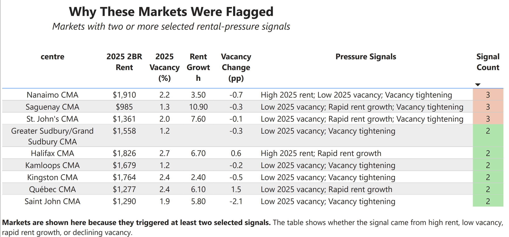

# Canadian Rental Market Pressure Analysis

I used CMHC rental-market data to compare rent, vacancy, and recent market changes across major Canadian centres. The goal was to identify cities showing multiple rental-market pressure signals at the same time.

---

## What I Found

The analysis highlights markets with different pressure patterns rather than declaring one city “worst.”

* **Nanaimo** showed high 2025 two-bedroom rent, low vacancy, and a decline in vacancy from 2024.
* **St. John’s** and **Saguenay** combined low vacancy, faster rent growth, and lower vacancy than the prior year.
* **Halifax** crossed the high-rent and rapid-growth thresholds.
* **Vancouver, Toronto, Victoria, and Calgary** had high two-bedroom rents, but did not show the same combination of tightening vacancy and rapid growth in this 2024–2025 comparison.

These results are intended for market monitoring. They do not explain why rents or vacancies changed.

---

## Method

* Cleaned CMHC Rental Market Survey Table 1.0 data for major centres.
* Used 2025 rent, vacancy, rent growth, and vacancy change indicators.
* Created data-driven thresholds using SQLite window functions.
* Assigned transparent market-pressure labels using SQL CASE statements.
* Preserved data-quality flags and excluded caution-quality records from threshold calculations.

---

## Data-Driven Thresholds (2025)

The analysis identifies rental-market signals using transparent benchmarks. High rent and rapid rent growth thresholds were calculated from the distribution of included markets. Low vacancy reflects limited availability, while vacancy tightening indicates that the vacancy rate decreased from 2024 to 2025.

* High Rent: >= $1,802
* Low Vacancy: <= 2.5%
* Rapid Rent Growth: >= 6.1%
* Vacancy Tightening: Vacancy rate decreased from 2024 to 2025

---

## Tools

Python, pandas, SQLite, SQL, Jupyter Notebook, and Power BI.

---

## Power BI Dashboard

The project includes a two-page Power BI report:

* Overview: compares high-cost rental markets with markets showing multiple rental-pressure signals.
* Pressure Details: shows the rent, vacancy, rent-growth, and vacancy-change conditions behind each flagged market.

Note: The interactive Power BI report was developed in an SFU-managed workspace, where public web publishing is restricted. Dashboard screenshots and an [exported PDF](outputs/canadian_rental_market_deck.pdf) are included in this repository so the report can be reviewed without organizational access.




---

## Project Brief Slide Deck

View or download the presentation assets:
* **[PDF Presentation Slide Deck](outputs/canadian_rental_market_deck.pdf)** — Printable landscape presentation slide deck.
* **[Slide Outline (Markdown)](outputs/project_brief_deck.md)** — Slide-by-slide text outline of the presentation.

---

## Repository Structure

```
notebooks/     Data cleaning and SQL analysis
sql/           SQL queries used for analysis
data/          Raw and processed datasets
outputs/       Dashboard-ready tables and charts
database/      SQLite database
```

---

## Data Source

* [CMHC Rental Market Survey Data Tables](https://www.cmhc-schl.gc.ca/)
* [Statistics Canada Table 34-10-0133-01](https://www150.statcan.gc.ca/t1/tbl1/en/tv.action?pid=3410013301)
* [CMHC Licence Agreement for the Use of Data](https://www.cmhc-schl.gc.ca/about-us/terms-conditions/hmip-terms-conditions)
* [CMHC Rental Market Survey Methodology](https://www.cmhc-schl.gc.ca/professionals/housing-markets-data-and-research/housing-research/surveys/methods/methodology-rental-market-survey)
